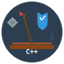

# Catapult



Catapult is a C++20 library that provides secure, high-performance token-based authorization for MOQT (Media Over QUIC Transport) streaming applications. 

## Build Process

### Prerequisites

- **C++ Compiler**: GCC-12+ or Clang-17+ with full C++20 support
- **CMake**: 3.16 or later
- **Git**: For cloning and submodule management
- **Dependencies**: OpenSSL, libcbor, nlohmann-json, spdlog

### Clone and Setup

```bash
# Clone the repository
git clone <repository-url>
cd catapult

# Initialize and update submodules
git submodule update --init --recursive
```

### Local Build

```bash
# Create build directory
mkdir build && cd build

# Configure with CMake
cmake .. -DCMAKE_BUILD_TYPE=Release -DENABLE_LOGGING=ON

# Build the project
make -j$(nproc)

# Run tests
./catapult_tests

### Running Tests

```bash
# Run all tests
./catapult_tests

# Run specific test categories
./catapult_tests --test-case="*moqt*"      # MOQT tests only
./catapult_tests --test-case="*claims*"    # Claims tests only

# Verbose output
./catapult_tests --verbose
```

## Benchmarks

### Local Benchmarks

```bash
# Google Benchmark executable (if available)
./build/catapult_benchmarks

```


## License

This project is licensed under the MIT License. See the [LICENSE](BSD-2-Clause.txt) file for full license terms.
