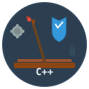

# Catapult



[](https://github.com/Quicr/catapult/actions/workflows/ci.yml)
[](https://github.com/Quicr/catapult/actions/workflows/sanitizers.yml)
[](https://github.com/Quicr/catapult/actions/workflows/format.yml)
[](BSD-2-Clause.txt)
[](https://en.cppreference.com/w/cpp/20)

| Platform | Architecture | Status |
|----------|-------------|--------|
|  Linux | x86_64, ARM64 | [](https://github.com/Quicr/catapult/actions/workflows/ci.yml?query=branch%3Amain+os%3Aubuntu-latest) |
|  macOS | x86_64, ARM64 | [](https://github.com/Quicr/catapult/actions/workflows/ci.yml?query=branch%3Amain+os%3Amacos-latest) |

Catapult is a modern C++ library that provides secure, high-performance implementation
for Common Access Token. One of the primary application goals for Catapult is 
supporting authorization for Media Over QUIC applications. However, the 
library is designed to be flexible and can be used in various other contexts
where secure token-based access control is required.

## Build Process

### Prerequisites

- C++ Compiler: GCC-12+ or Clang-17+ with full C++20 support
- CMake: 3.16 or later
- Git: For cloning and submodule management
- Just: `cargo install just` or `brew install just` (optional, for justfile support)
- Dependencies: OpenSSL, libcbor, nlohmann-json, spdlog

### Clone and Setup

```bash
# Clone the repository
git clone <repository-url>
cd catapult

# Initialize and update submodules
git submodule update --init --recursive
```

### Local Build

#### Using Just (Recommended)

```bash
# Build the project (using make internally)
just build

# Build using cmake directly
just build-cmake

# Run tests
just test

# Run specific test categories
./build/catapult_tests --test-case="moqt"      # MOQT tests only
./build/catapult_tests --test-case="claims"    # Claims tests only

# Clean build directory
just clean

# Show all available commands
just help
```

#### Using Make (Traditional)

```bash
# Build the project
make

# Run tests  
make test

# Show all available commands
make help
```

#### Using CMake Directly

```bash
# Create build directory
mkdir build && cd build

# Configure with CMake
cmake .. -DCMAKE_BUILD_TYPE=Release -DENABLE_LOGGING=ON

# Build the project
make -j$(nproc)

# Run tests
./catapult_tests

# Run specific test categories
./catapult_tests --test-case="moqt"      # MOQT tests only
./catapult_tests --test-case="claims"    # Claims tests only

# Verbose output
./catapult_tests --verbose
```

## Docker Build and Test

### Quick Start with Docker Scripts

Build the project:
```bash
# Build for Alpine 
./docker-build.sh

# Build for Alpine x86_64 (explicit)
./docker-build.sh alpine

# Build for Raspberry Pi ARM64
./docker-build.sh raspberrypi

# Clean build
CLEAN=true ./docker-build.sh alpine
```

Run tests:
```bash

# Run basic tests on specific platform
./docker-test.sh alpine
./docker-test.sh raspberrypi

# Run all test types (basic, memory, performance, analysis)
./docker-test.sh alpine all
./docker-test.sh raspberrypi all

```

## Sanitizer Testing (ASan/UBSan)

```bash
cmake -S . -B build-san \
  -DCMAKE_BUILD_TYPE=Debug \
  -DCATAPULT_ENABLE_SANITIZERS=ON \
  -DENABLE_LOGGING=OFF

cmake --build build-san -j$(nproc 2>/dev/null || sysctl -n hw.ncpu)

# Run tests under sanitizers
ASAN_OPTIONS="detect_leaks=1:halt_on_error=1" \
UBSAN_OPTIONS="halt_on_error=1:print_stacktrace=1" \
ctest --test-dir build-san --output-on-failure --timeout 600
```

On macOS, remove `detect_leaks=1` as it is not supported.

## Benchmarks

### Local Benchmarks

```bash
# Google Benchmark executable (if available)
./build/catapult_benchmarks
```


